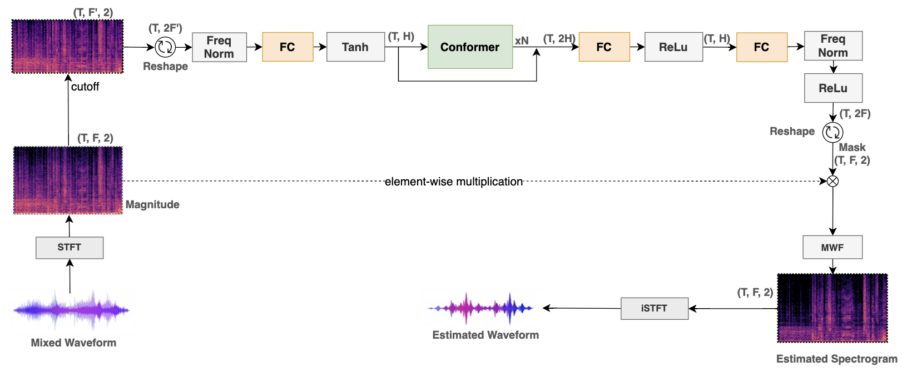

# eCMU (Coming soon!!!)
<b>This is an Official implementation of eCMU: An Efficient Phase-aware Framework for Music Source Separation with Conformer (IEEE RIVF23) </b>
<p align="center">
  
</p>

Our implementation was developed based on the [`sdx23-aimless`](https://github.com/aim-qmul/sdx23-aimless.git) framework.

## Demo Page:
🎼 You can remix songs and enjoy [here](https://thamquocdung.github.io/eCMU-demo/) 📻

## Abstract
From our baseline [Open-Unmix](https://github.com/sigsep/open-unmix-pytorch) (UMX), we:
- Attempt to build an affordable model to solve the music source separation (MSS) task in the spectral domain with limited computing resources.
- Apply a differentiable Multi-channel Wiener Filter (MWF) into a mask-based prediction model to end-to-end estimated the complex spectrogram for each source.
- Optimize the model by using the Multi-domain loss function on the public [`MUSDB18-HQ`](https://sigsep.github.io/datasets/musdb.html#musdb18-hq-uncompressed-wav) dataset.
- Leverage the ability of Conformer blocks to capture both local and global feature dependencies on time and frequency axis.

## Installation
- python 3.8+
- pytorch-lightning
- pytorch

```bash
pip install -r requirments.txt
```

## Getting Started
_Note: eCMU is a single-target model. This means each stem is separated by a specific model. Therefore, there are four single models in total._
- Download model weight at ...
- To separate **all sources** on `gpu`:
```bash
python -m core.models.separator 
    assets/samples/22_TaylorSwift.mp3  
    --model_ckpt ckpt_path/
```

- To separate **all sources** on `cpu`:
```bash
python -m core.models.separator 
    assets/samples/22_TaylorSwift.mp3  
    --model_ckpt ckpt_path/ 
    --no-gpu
```
- Or, even if you want to separte a **subset of stems** (i.e: only {`vocals`, `drums`}), you can run:
```bash
python -m core.models.separator 
    assets/samples/22_TaylorSwift.mp3  
    --targets vocals drums
    --model_ckpt ckpt_path/ 
```
Other audio formats: `.wav`, `.m4a`, `.aac` are also supported.
## Training
```bash
python main.py fit --config cfg/vocals.yaml
# python main.py fit --config cfg/drums.yaml
# python main.py fit --config cfg/bass.yaml
# python main.py fit --config cfg/other.yaml
```

Look into the `.yaml` files, if you want to modify hyper-parameters, training arguments, data pipeline,...

## Evaluation
`SDR`: median of the chunk-level SDR. This is a standard evaluation metric proposed in [SiSEC18](https://arxiv.org/abs/1804.06267) and implemented in [`museval`](https://github.com/sigsep/sigsep-mus-eval). 
<!-- - `uSDR`: mean score of utterance-level SDR proposed in the Music Demixing Challenge ([MDX](https://arxiv.org/abs/2108.13559)). This is a faster version of SDR. -->

| Method               | #params (M) | extra data? |vocals | drums | bass | other | all  |
| :---                 | :---:       | :---:       |:---:  | :---: | :---:| :---: | :---:|
|  UMX  (h=512)        | 8.9         | no          | 6.25  | 6.04  | 5.07 | 4.28  | 5.41 |
|  UMXL (h=1024)       | 28.2        | yes         | 7.21  | 7.15  | 6.02 | 4.89  | 6.32 |
|  X-UMX               | 35.6        | no          | 6.61  | 6.47  | 5.43 | 4.46  | 5.79 |
|  Spleeter            | 9.8         | yes         | 6.86  | 6.71  | 5.51 | 4.02  | 5.91 |
|  Hybrid-Demucs       | 83.6        | no          | 8.13  | 8.24  | 8.67 | 5.59  | 7.68 |
|  Ours (small, h=256) | 3.8         | no          | 6.56  | 6.68  | 5.34 | 4.57  | 5.79 |
|  Ours (large, h=1024)| 37.0        | no          | 7.59  | 7.09  | 5.91 | 5.50  | 6.52 |

- To evaluate all sources from our public weights:
  ```bash
  python evaluate.py --all --model_ckpt ckpt_path/ --data_root data_path/
  ```
- To evaluate only 1 source once training a model, remeber to replace `ckpt_path` in `.yaml` config file:
  ```bash
  python evaluate.py --config cfg/vocals.yaml --data_root data_path/
  ```
## Citations
If you find our eCMU useful, please consider citing as below:
```
@INPROCEEDINGS{dungtham2023eCMU,
  author={Tham, Quoc Dung and Nguyen, Duc Dung},
  booktitle={2023 RIVF International Conference on Computing and Communication Technologies (RIVF)}, 
  title={eCMU: An Efficient Phase-aware Framework for Music Source Separation with Conformer}, 
  year={2023},
  pages={447-451},
  doi={10.1109/RIVF60135.2023.10471783}
}
```
